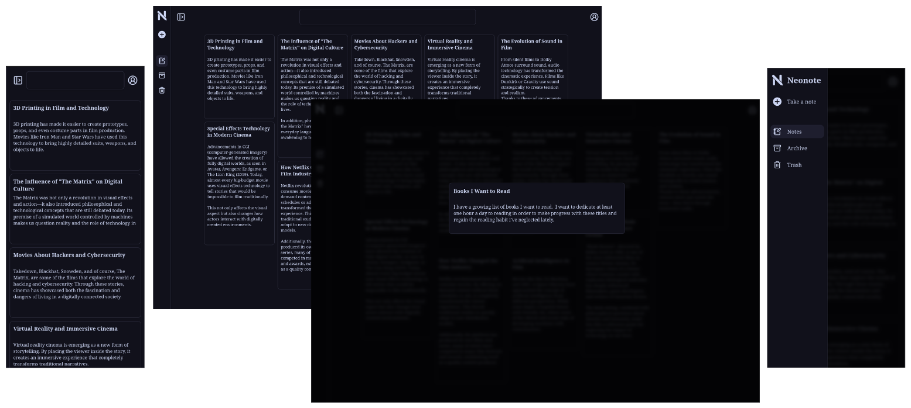

<div align="center">
  
  <h1 style="color: red;">Neonote</h1>
  <h3>A fast, self-hosted note-taking application.</h3>
  
</div>

## ✨ Features
### 📝 Note Management
- [X] ✍️ **Basic Editor**: Simple implementation for quick note-taking
- [X] 🗃️ **Archive**: Tab for archived notes
- [X] 🗑️ **Trash**: Tab to temporarily store or permanently delete notes
- [ ] ✍️ **Markdown Editor**: Rich editor with real-time preview
- [ ] 📁 **Organization**: Folders, tags, and categories
- [ ] 🔍 **Advanced Search**: Search across content and metadata
- [ ] 📎 **Attachments**: Upload images, documents, and multimedia files

### 🤖 AI Features
- [ ] 💬 **Chat with Your Notes**: Ask questions about your content
- [ ] 📖 **Auto Summarization**: Generate summaries for long notes
- [ ] 🏷️ **Smart Tagging**: Automatically suggests relevant tags
- [ ] 💡 **Suggestions**: Recommends related notes while you write
- [ ] 🔍 **Semantic Search**: Find notes by meaning, not just keywords
- [ ] 🗣️ **Transcription**: Convert audio to text using AI
- [ ] 🎯 **Pattern Detection**: Identify recurring topics

### 🔒 Privacy & Security
- [x] 🏠 **100% Self-Hosted**: Your data never leaves your server
- [x] 🛡️ **Local Authentication**: No reliance on external services
- [ ] 🤖 **Local AI:**: Fully offline AI processing

### 🔧 Technical Features
- [x] 🐳 **Docker Ready**: One-command installation
- [ ] 🔄 **Automatic Backups**: Scheduled data backups

### 🎨 User Experience
- [x] 🌙 **Dark Mode**: Based on the Catppuccin theme
- [x] 📱 **Responsive Design**: Works on desktop, tablet, and mobile
- [x] 📐 **Flexible Layout**: Resizable panels
- [ ] ⚡ **Instant Search**: Results appear as you type
- [ ] ⌨️ **Keyboard Shortcuts**: Navigate quickly without a mouse
- [ ] 🎨 **Customizable Themes**: Change colors and fonts

## 🚀 Quick Installation

### Using Docker Compose (Recommended)

Create a `docker-compose.yaml` file with the following content:

```yaml
services:
    neonote:
        container_name: neonote
        image: ghcr.io/djaredev/neonote:latest
        user: 1000:1000 # Change 1000:1000 to your user ID and group ID
        ports:
            - "1717:1717"
        environment:
            - SUPERUSER_USERNAME=admin # Change it to your desired username
            - SUPERUSER_EMAIL=admin@example.com # Change it to your desired email
            - SUPERUSER_PASSWORD=password # Change it to your desired password (minimum 8 characters)
        volumes:
            - ./data:/data # Change ./data to the directory where you want the data to be stored persistently.
        restart: unless-stopped
```

Replace the environment variable values with your own. See the Configuration section for details.

In the directory where `docker-compose.yaml` is located, run:

```bash
docker-compose up -d
```

### Using Docker CLI

```bash
docker run -d \
  --name neonote \
  -u 1000:1000 \
  -p 1717:1717 \
  -e SUPERUSER_USERNAME=admin \
  -e SUPERUSER_EMAIL=admin@example.com \
  -e SUPERUSER_PASSWORD=password \
  -v ./data:/data \
  --restart unless-stopped \
  ghcr.io/djaredev/neonote:latest
```

## ⚙️ Configuration

Environment Variables:

| Variable | Description | Default Value | Required |
| -------- | ----------- | ---------------- | --------- |
| `SUPERUSER_USERNAME` | It is self-explanatory. | - | ✅ |
| `SUPERUSER_EMAIL` | It is self-explanatory | - | ✅ |
| `SUPERUSER_PASSWORD` | It is self-explanatory | - | ✅ |

## 📱 Usage 

Once neonote has started successfully, you can access the application at:

[http://localhost:1717](http://localhost:1717)

## 📄 Licence

This project is licensed under the MIT License. See the [LICENSE](LICENSE) file for more details.
